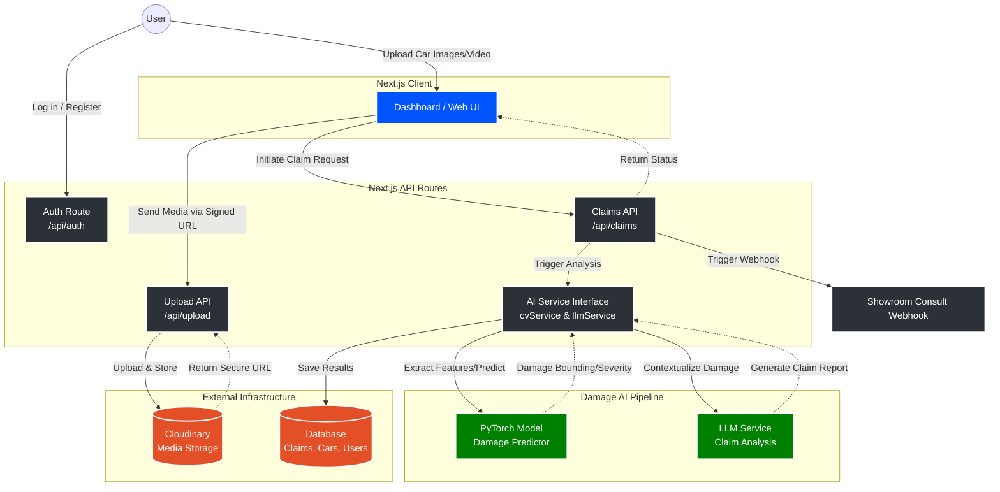

# Car Damage Analyser

Insurance-claim assistant: **Next.js web app** (`claimvision-web/`) for registration, vehicles, Cloudinary video uploads, and AI-assisted damage analysis; **Python tooling** (`damage-ai-services/`) for CV model training, dataset labeling, and optional email notifications via SMTP and Groq.

For deeper architecture notes aligned with the codebase, see [PROJECT_CONTEXT.txt](./PROJECT_CONTEXT.txt).

**Live preview:** [https://insurance-claim-app-seven.vercel.app/](https://insurance-claim-app-seven.vercel.app/)

---

## Repository layout

| Path                  | Purpose                                                                                         |
| --------------------- | ----------------------------------------------------------------------------------------------- |
| `claimvision-web/`    | ClaimVision Next.js 16 app (App Router): auth, dashboard, APIs, CV + LLM integration            |
| `damage-ai-services/` | PyTorch CV notebook, Groq-based image annotation, FastAPI microservice + LangGraph + Gmail SMTP |
| `PROJECT_CONTEXT.txt` | Maintainer-oriented context (routes, env vars, pipeline behavior)                               |

---

## System Architecture



## Web app (`claimvision-web/`) — ClaimVision

### What it does

Users sign in (email/password or Google), register cars, upload claim videos to Cloudinary, and run an in-process pipeline: an external **CV HTTP service** returns a fixed **18 body-region** assessment map; **Exa AI** (OpenAI-compatible API) produces structured repair recommendations in INR. Data is stored in **MongoDB** (Mongoose).

### Tech stack

- Next.js 16.x, React 18, TypeScript
- NextAuth v4 (JWT), Credentials + Google
- MongoDB + Mongoose 8, Zod validation
- Cloudinary (signed client uploads)
- CV: `lib/ai/cvService.ts` — GET `CV_API_URL?video_url=<url>` (see [PROJECT_CONTEXT.txt](./PROJECT_CONTEXT.txt) §10A)
- LLM: `lib/ai/llmService.ts` — Exa at `https://api.exa.ai` (non-streaming first, Zod-validated JSON)
- Route protection: `claimvision-web/proxy.ts` (Next.js 16 proxy pattern, not `middleware.ts`)

### Run the web app

```bash
cd claimvision-web
npm install
```

Create `claimvision-web/.env` or `claimvision-web/.env.local` with at least:

- `NEXTAUTH_URL`, `NEXTAUTH_SECRET`
- `MONGODB_URI`
- `GOOGLE_CLIENT_ID`, `GOOGLE_CLIENT_SECRET` (if using Google)
- `CLOUDINARY_CLOUD_NAME`, `CLOUDINARY_API_KEY`, `CLOUDINARY_API_SECRET`
- `CV_API_URL` — base URL for your CV analyzer (must accept `video_url` query param)
- `EXA_API_KEY` — Exa AI key (`OPENAI_API_KEY` may be accepted as fallback in code; prefer `EXA_API_KEY`)

Optional: `CV_API_TIMEOUT_MS`, `EXA_LLM_MODEL`, `EXA_MAX_TOKENS`, `EXA_TIMEOUT_MS` — see [PROJECT_CONTEXT.txt](./PROJECT_CONTEXT.txt) §4.

```bash
npm run dev
```

Open `http://localhost:3000`.

### NPM scripts

| Command         | Description        |
| --------------- | ------------------ |
| `npm run dev`   | Next.js dev server |
| `npm run build` | Production build   |
| `npm run start` | Production server  |
| `npm run lint`  | ESLint             |

### High-level flow

```
User → Cloudinary upload → POST /api/claims → enqueue analysis
     → CV service (video_url) → save cvResponse (18 regions)
     → Exa LLM + car context → llmResponse → status completed
     → Dashboard polls /api/claims/[id]/status
```

Claim orchestration: `claimvision-web/lib/claims/processClaimAnalysis.ts` (in-process; suitable for long-lived Node hosts; serverless timeouts may apply).

---

## Damage AI services (`damage-ai-services/`)

This folder supports the **custom CV pipeline** and a **separate notification API** (not wired inside the Next.js app by default).

### 1. PyTorch model — `AI_Insurace_Pytorch.ipynb`

- **Architecture:** dual-stream **DualStreamHydra** — ConvNeXt-style CNN branch fused with a ViT branch for multi-head predictions per exterior part.
- **Training:** dataset from labeled images (see annotation script below); class-weighted loss; checkpoints such as `best_hydra_model.pth` / phased training to `best_hydra_model_phase2.pth`.
- **Inference:** notebook includes loading weights and **`analyze_video(video_path, ...)`** — frame sampling, per-part predictions, aggregated report.
- **Weights:** `.pth` files are large; they are listed in `.gitignore` — store them outside the repo or use Git LFS if you must version them.

Because the trained model weights could not be uploaded to GitHub due to size limits, the model is hosted on a Hugging Face Space for testing. Use this placeholder link and replace it with the actual Space URL:

- **Hugging Face Space:** [Test the model here](https://huggingface.co/spaces/KamranNITSRI/Car_Damage_Hydra_Vision)

To use this with ClaimVision, you would expose an HTTP service that matches what `claimvision-web/lib/ai/cvService.ts` expects: JSON with the **18 snake_case region keys** and assessment values (e.g. Replacement / No Damage / repair), optionally wrapped under `data` or `result` (see `cvApiNormalize.ts`).

### 2. Dataset labeling — `data_annotation_script.py`

- Uses **Groq** vision (`meta-llama/llama-4-scout-17b-16e-instruct`) to score each of the **18 standard parts** from `0`–`3` (none → severe) for images under `./raw_crash_images`.
- Writes append-only **`labels.csv`** with columns `filename` + one column per part.
- Env: script uses `GROK_API` (note spelling in file) for the API key.
- Includes a session request cap to avoid burning daily quota.

### 3. LangGraph + SMTP + Groq — `main.py`

- **LangGraph** `StateGraph`: single `notify` node.
- **Groq** (`llama-3.3-70b-versatile`) generates two bodies of text: a friendly email to the **customer** and a structured request to a **service center**.
- **SMTP:** Gmail (`smtp.gmail.com`, port `587`, STARTTLS). Sender is set in code; **`EMAIL_PASSWORD`** should be a Gmail app password (via `python-dotenv` / `.env`).
- **`GROQ_API_KEY`** for Groq.
- **Security note:** replace hardcoded sender/service addresses with environment variables before production; never commit real passwords.

### 4. FastAPI bridge — `api_services1.py`

- **`POST /process`** on port **8500** (default `uvicorn` in `__main__`).
- Body (Pydantic): `brand`, `model`, `year`, `cvResponse` (dict), `urgency`, `totalEstimatedMin` / `totalEstimatedMax`, `name`, `email`, `phone`.
- Maps payload into the LangGraph state and calls `main.main_`, which triggers the emails.

Run locally:

```bash
cd damage-ai-services
# Create .env with GROQ_API_KEY, EMAIL_PASSWORD (and fix env var names to match each script)
python api_services1.py
```

Install dependencies as needed (e.g. `fastapi`, `uvicorn`, `langgraph`, `groq`, `python-dotenv`, `pydantic`).

---

## Environment summary

### Next.js (`claimvision-web/`)

See [PROJECT_CONTEXT.txt](./PROJECT_CONTEXT.txt) §4 for the full variable list (`NEXTAUTH_*`, `MONGODB_URI`, Cloudinary, `CV_API_URL`, Exa keys, etc.).

### Python (`damage-ai-services/`)

| Variable         | Used in                     | Purpose                    |
| ---------------- | --------------------------- | -------------------------- |
| `GROQ_API_KEY`   | `main.py`                   | Groq chat completions      |
| `EMAIL_PASSWORD` | `main.py`                   | Gmail SMTP login           |
| `GROK_API`       | `data_annotation_script.py` | Groq client for annotation |

Align naming across scripts or use a single `.env` with duplicates only if you keep both spellings.

---

## Contributing / docs

When you change architecture (auth, CV contract, LLM provider, claim pipeline), update **README.md** and **PROJECT_CONTEXT.txt** together.

---

## License

Add a `LICENSE` file if you publish to GitHub.
